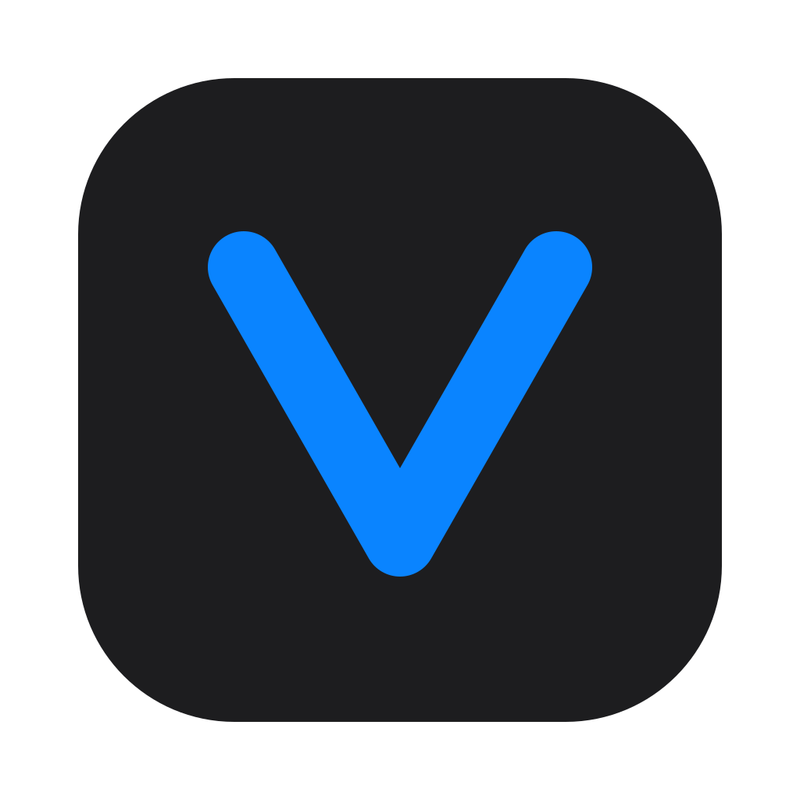
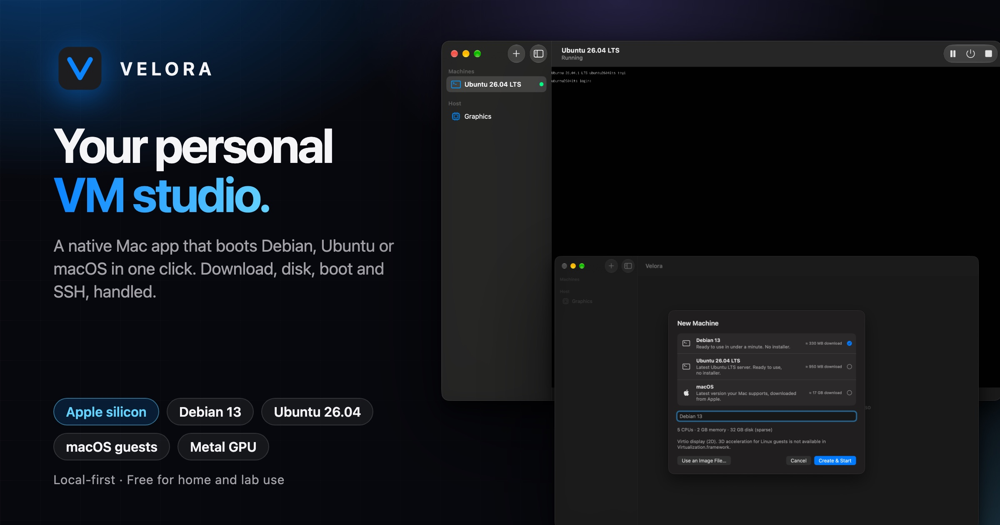

# Velora

**VMs, models and clusters on your Mac.**

[**Download**](https://github.com/zyvorai/velora/releases/latest) · [Website](https://zyvorai.github.io/velora/) · [Install guide](docs/INSTALL.md) · [Tutorials](docs/tutorials/README.md)

Velora is a native Mac app for Apple silicon (macOS 26 or newer). It boots Debian, Ubuntu or macOS virtual machines in one click on
Apple's Virtualization framework, and runs a local AI platform on the same Mac: MLX models and OpenAI-compatible endpoints, LoRA
training, k3s clusters, and a fleet of Macs.

This repository holds the **website, documentation and downloadable builds** (see Releases). It does not contain the app's source code.

## Get started

1. Download `Velora-<version>.dmg` from [Releases](https://github.com/zyvorai/velora/releases/latest) and check its `.sha256`.
2. Open the DMG and drag Velora to Applications. The build is ad-hoc signed, not notarized: right-click, Open the first time.
3. Press **⌘N**, choose Debian, Ubuntu or macOS, then **Create & Start**.

Read the [install guide](docs/INSTALL.md), then the [tutorials](docs/tutorials/README.md): [your first VM](docs/tutorials/01-first-vm.md),
[a private OpenAI-compatible endpoint](docs/tutorials/02-private-openai-endpoint.md), [fine-tuning with LoRA](docs/tutorials/03-fine-tune-lora.md),
[a k3s cluster](docs/tutorials/04-k3s-cluster.md), [FluxVM and Kairon](docs/tutorials/05-fluxvm-and-kairon-on-a-mac.md) and
[a fleet of Macs](docs/tutorials/06-fleet-of-macs.md). [How it works](docs/how-it-works.md) explains the pieces.

## Coming in 0.4

Verified on an Apple M4 and on its way to the next build (not in the current download yet). What ran is listed in
[docs/RELEASE.md](docs/RELEASE.md#next-release-04).

- **Machines:** snapshots and restore, clones with a fresh identity, suspend to disk and resume, shared folders, port forwards on
  `127.0.0.1`, and for Linux guests a live serial console plus commands and file copy through a small vsock agent that works even
  with the guest's network down. **Install Agent** adds it to guests made by older builds.
- **Models:** a benchmark per endpoint (time to first token, tokens per second), and a fit check that refuses downloads too big
  for your Mac.
- **FluxVM:** image names, port forwards, shared folders, console, commands, file copy, snapshots and clones from the app.
- **Fleet:** a card per Mac with memory, heat, memory pressure, tokens per second and Thunderbolt links.
- **One model across Macs (experimental):** EXO-backed endpoints behind the same gateway and keys. Not yet run on two Macs.
- **Signed and notarized builds** once a Developer ID is configured for releases.

## Licensing

- **The app** is under the Business Source License 1.1 ([LICENSE-APP.txt](LICENSE-APP.txt)): free for personal and home use, learning,
  research, labs, development and testing (including inside a company); production business use needs a commercial licence. Plain
  words: [LICENSING.md](LICENSING.md).
- **macOS guests** are licensed by Apple, not by Velora: [MACOS-LICENSING.md](MACOS-LICENSING.md). Velora limits you to two active
  macOS guests by default and asks you to confirm Apple's terms the first time.
- **This website and documentation** are Copyright 2026 Zyvor AI Labs, all rights reserved ([LICENSE](LICENSE)).

Builds before 0.4 (0.3.x) were released earlier under Apache-2.0.

## Support and security

[Open an issue](https://github.com/zyvorai/velora/issues/new?template=bug_report.md) with your Mac model, macOS version and Velora
version. Report vulnerabilities privately as described in [SECURITY.md](SECURITY.md).
