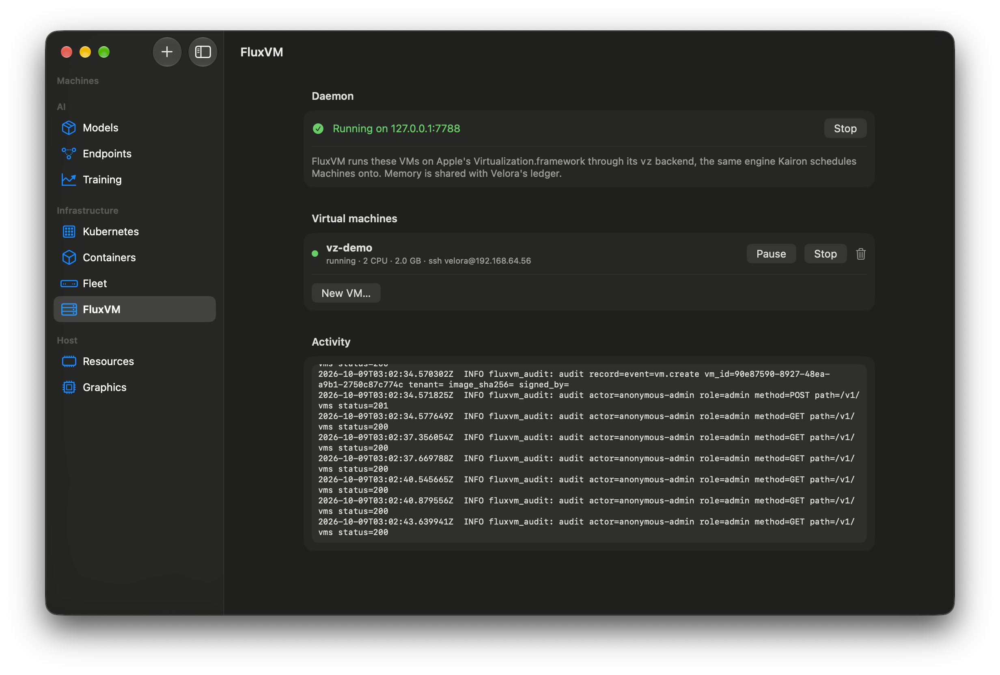

# FluxVM in Velora

[FluxVM](https://github.com/zyvorai/zyvor-fluxvm) is a VM control plane with a REST API, a scheduler and `fluxctl`. Its Mac port adds a **`vz` backend** that runs VMs on Apple's Virtualization.framework, so the same API that drives KVM on Linux can drive VMs on a Mac.

## What it does in Velora
**Infrastructure → FluxVM** supervises a local `fluxctl serve` daemon (API on `127.0.0.1:7788`), lists its VMs with their addresses (`ssh velora@…`), and lets you create, pause, resume, stop and delete them. Every running FluxVM VM is reserved in Velora's memory ledger, so models, training and VMs share one honest picture.

## Use it
1. Build FluxVM (see its `docs/macos.md`): `cargo build -p fluxctl` also builds and ad-hoc signs the Virtualization.framework runner. Velora finds `fluxctl` via `FLUXVM_FLUXCTL`, `~/.cargo/bin`, or a sibling `fluxvm` checkout.
2. Open **FluxVM** and press **Start** (it also starts when you open the screen).
3. **New VM…**: choose a raw ARM64 Linux disk (qcow2 must be converted), CPUs and memory. The VM boots with cloud-init: user `velora`, your SSH keys and Velora's key. From 0.4 you can also pick a FluxVM image name (`debian-13`, `ubuntu-26.04`, …), TCP port forwards (`8080:80`, listening on `127.0.0.1`) and shared folders (mounted with virtiofs at their guest path).
4. From 0.4, per VM: **Console & Command** streams the serial console and runs commands or copies files through FluxVM's agent route; the **Snapshots** sheet takes, restores (VM stopped) and deletes snapshots of memory, devices and disk; a stopped VM has a **Clone** button.
5. Equivalent without the app: `fluxctl serve`, then `POST /v1/vms` with `"backend": "vz"` (on a Mac, `"auto"` resolves to `vz`).

## How it fits with the rest
- **[Kairon](kairon.md)** sends Machines to this same daemon: Kairon is the scheduler, FluxVM is the engine.
- A signed runner process per VM holds the `VZVirtualMachine` and reports the guest's address, which macOS offers no other way to learn.

## Verified and not
**Verified** on an Apple M4, macOS 27.2: FluxVM's live test (create, SSH, pause, resume, stop, restart, delete) and Velora 0.4's `--selftest fluxvm`: REST create with a port forward and a shared folder, ledger accounting, command exec with separate stdout/stderr, a 100 KB file copy both ways, the forward reaching sshd, the console stream, snapshot of a running VM and restore (a marker file returns to its earlier value), snapshot delete, pause, resume, stop, clone (APFS copy of the raw disk; the clone keeps the source's files and takes its own hostname), delete, and the HTTP log stream delivering a quiet console's last lines at once. **Not verified:** macOS guests, the guest-agent vsock proxy, Intel Macs. **Not supported by `vz`:** tap networking, UDP forwards on NAT, NUMA, hugepages, hotplug, TPM, live migration, cloning a macOS guest (use a template's disk). Clone and the immediate log stream need a FluxVM build that includes its `vz` clone and log-stream fixes (FluxVM 0.4 branch).

Tutorial: [5. FluxVM and Kairon on a Mac](tutorials/05-fluxvm-and-kairon-on-a-mac.md).
