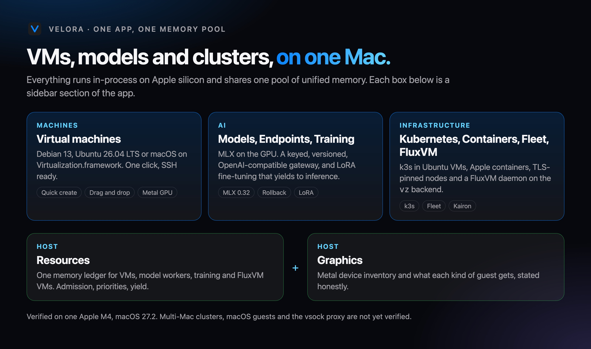
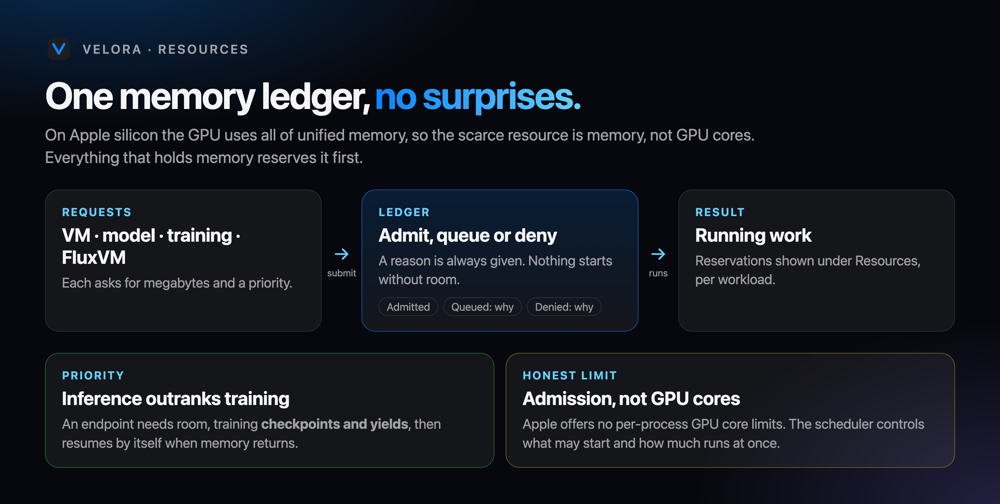
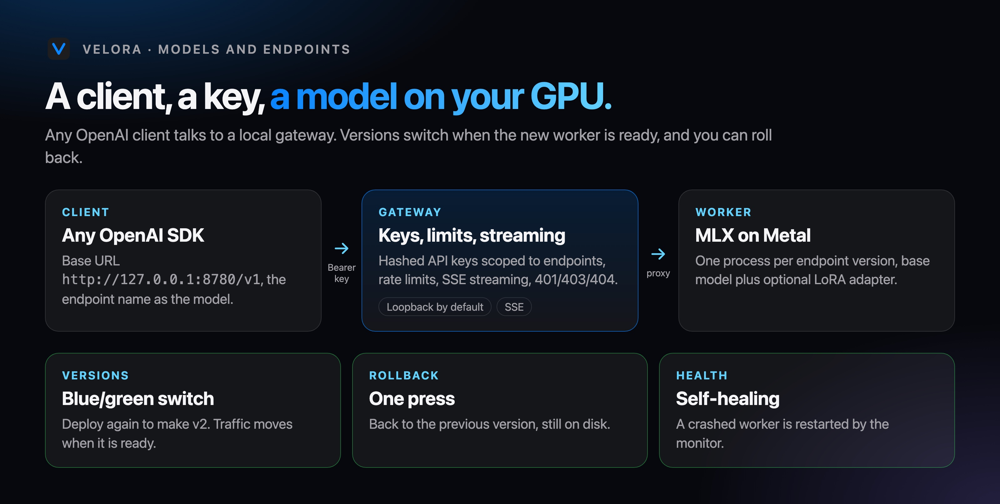
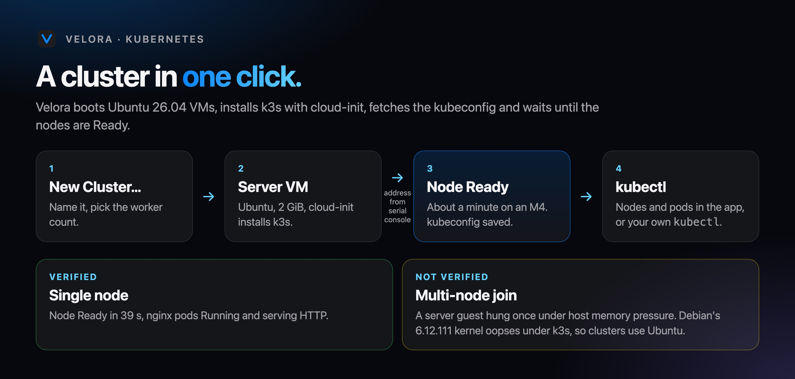
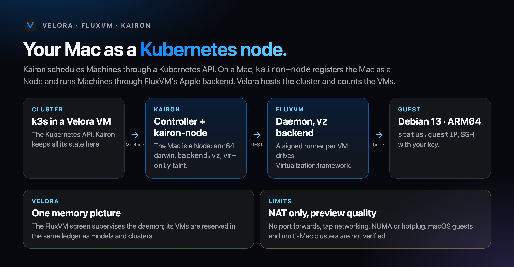
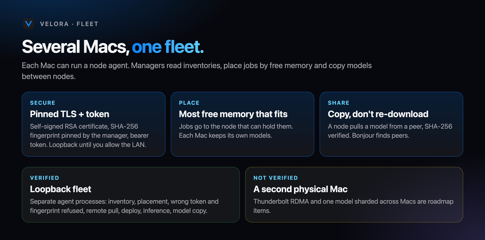

# How Velora works

Velora is one SwiftUI app that runs everything in-process on your Mac: VMs on Virtualization.framework, models on MLX, clusters in Velora VMs, and optional links to [FluxVM](https://github.com/zyvorai/zyvor-fluxvm) and [Kairon](https://github.com/zyvorai/zyvor-kairon). This page is the map; the [tutorials](tutorials/README.md) are the walkthroughs.

## One memory ledger

On Apple silicon the CPU and GPU share unified memory, so the scarce resource is **memory**, not GPU cores. Everything that holds memory reserves it in a single `ResourceLedger` (`native/App/Platform/Scheduler.swift`): VMs, model workers, training jobs and FluxVM VMs.

- **Admission:** a request is admitted, queued with a reason, or denied. Nothing starts without room.
- **Priorities:** inference outranks training. If an endpoint needs memory, a running training job **checkpoints and yields**, then resumes by itself when memory returns.
- **Honest limit:** Apple offers no per-process GPU core limits, so the scheduler controls admission and concurrency, not GPU cores. **Resources** shows the ledger.

## Models and endpoints

1. An isolated runtime (uv-managed Python, MLX 0.32.3, `mlx-lm`) lives under `~/Library/Application Support/Velora/Platform/Runtimes`.
2. Models come from Hugging Face with resumable, SHA-256-verified downloads.
3. An **endpoint** is a name with versions. Each version is an `InferenceWorker` process serving one model (and optionally a LoRA adapter).
4. The **gateway** is an OpenAI-compatible HTTP server (`/v1/chat/completions`, streaming over SSE). It checks hashed API keys, per-key endpoint scopes and rate limits, and proxies to the active version. Deploying a new version switches traffic when the worker is ready; **Roll Back** switches back. A health monitor restarts a crashed worker.

## Training

`mlx_lm.lora` runs as a supervised job with checkpoints. Pause waits for a checkpoint and releases memory; resume continues from it. A finished job registers an **adapter** that you deploy as a new endpoint version.

## Kubernetes

A cluster is a set of Velora VMs. Velora boots an **Ubuntu 26.04** server (and optional workers) with a cloud-init script that installs k3s, learns each guest's address from its serial console, fetches the kubeconfig, and waits for the nodes. The app shows nodes and pods via `kubectl`.

## FluxVM and Kairon on a Mac

Pages: [Kubernetes](kubernetes.md) · [FluxVM](fluxvm.md) · [Kairon](kairon.md).

- **FluxVM** is a VM control plane with a REST API. The Mac port adds a `vz` backend: a signed helper process per VM drives Virtualization.framework over a unix control socket. Velora's **FluxVM** screen supervises a local daemon and counts its VMs in the ledger; its **Kairon** screen starts the controller and node against your Velora cluster and lists the Machines.
- **Kairon** schedules `Machine` resources through a Kubernetes API. On a Mac, `kairon-node` registers the Mac as a **Node** (arch `arm64`, os `darwin`, label `backend.vz`, allocatable from unified memory, a `vm-only` taint because there is no kubelet) and sends Machines to FluxVM with `backend: vz`.
- **Velora** hosts the Kubernetes API (k3s in a Velora VM), runs FluxVM, and shows both in one memory picture. Step by step: [tutorial 5](tutorials/05-fluxvm-and-kairon-on-a-mac.md).

## Fleet

Each Mac can run a **node agent**: TLS with a self-signed RSA certificate whose SHA-256 fingerprint the manager pins, plus a bearer token. Managers read an inventory (chip, memory, free memory, models, endpoints), place jobs on the node with the most free memory that fits, and copy models between nodes with checksum verification. Bonjour finds nodes on the LAN. Loopback-only until you allow the network.

## What is and is not verified

Everything above ran on one **Apple M4 with macOS 27.2**. Not verified: macOS guests, the vsock proxy, multi-node k3s, a second physical Mac, Thunderbolt clusters and cross-node model sharding, Apple's `container` tool. See [RELEASE.md](RELEASE.md).
