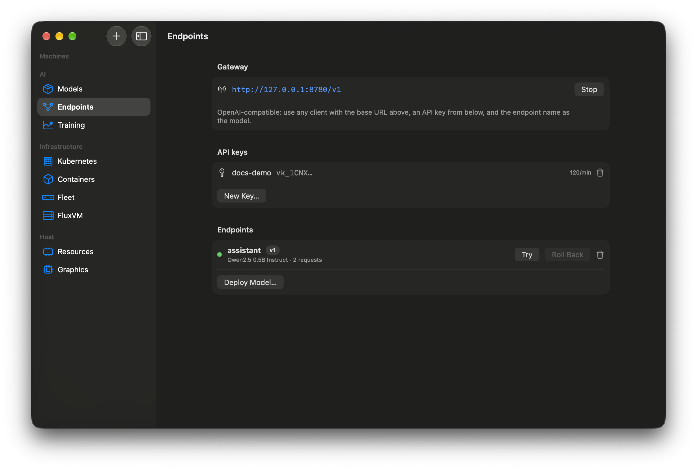

# 2. A private OpenAI-compatible endpoint



## Before you start
An Apple silicon Mac with 8 GB or more, network for the first run. Nothing leaves your Mac after the model is downloaded.

## Steps
1. Open **AI → Models**. The first time, Velora installs an **isolated MLX runtime** (its own Python, MLX 0.32.3) under `~/Library/Application Support/Velora/Platform`; it never touches your system Python.
2. In **Catalog**, **Download** *Qwen2.5 0.5B Instruct* (about 290 MB) to try it, or a larger model that fits your memory (the Models screen shows the memory each needs). Downloads are resumable and SHA-256 verified.
3. Open **AI → Endpoints** and press **Deploy Model…**. Pick the model, name the endpoint (for example `assistant`), press **Deploy**. Velora asks the memory scheduler for room first; if there is not enough it tells you why instead of starting.
4. Use the **Playground** at the bottom to chat; replies stream from your GPU through Metal.
5. Press **New Key…** under **API keys**, copy the secret (it is shown once and stored hashed).
6. Call it from anything that speaks the OpenAI API:
   ```bash
   curl http://127.0.0.1:8780/v1/chat/completions \
     -H "Authorization: Bearer <your key>" -H "Content-Type: application/json" \
     -d '{"model":"assistant","messages":[{"role":"user","content":"Hello from my Mac"}]}'
   ```
   The base URL is shown in the **Gateway** section. The endpoint name is the `model`.
7. Deploy a different model to the same name to create **version 2**; traffic switches when it is ready and **Roll Back** restores version 1.

## What you should see
Requests and latency counters rising on the endpoint, a worker listed under **Resources**, and its memory reserved in the ledger.

## Troubleshooting
- *"Not enough free memory yet":* the scheduler refused admission. Stop a VM or pick a smaller model; training jobs yield automatically.
- *401/403:* wrong key, or the key is limited to other endpoints.
- *Reachable only locally:* by design. The gateway binds to loopback unless you allow the LAN.

**Verified:** gateway self-test (keys, 401/403/404, streaming, rate limit, versions, rollback, killed worker restarted) and a runtime completion in 1.3 s on an Apple M4, macOS 27.2.
