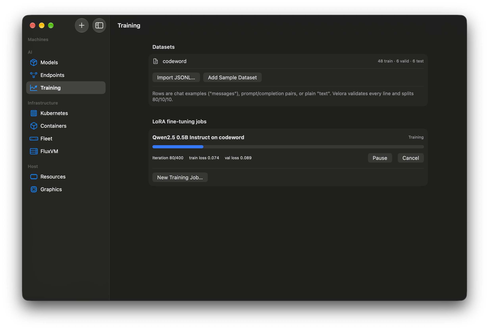

# 3. Fine-tune a model with LoRA

## Before you start
Tutorial 2 done (runtime installed, a model downloaded). Small models train in minutes.

## Steps
1. Open **AI → Training**. Under **Datasets** press **Import JSONL…** (chat or text rows) or **Add Sample Dataset** to try a tiny "codeword" set. Velora validates the file and splits it into train/valid/test.
2. Press **New Training Job…**, choose the **Base model** and **Dataset**, keep the safe defaults (batch size 4, learning rate 1e-4), then **Run**. The sheet shows how much memory it needs and how much is free.
3. Watch the job: iteration count, training and validation loss, checkpoints every few iterations.
4. **Pause** waits for a checkpoint and frees the process and its memory; **Resume** continues without losing or repeating work. If you deploy an endpoint while training and memory is short, training **yields**, then resumes by itself.
5. When it completes, press **Evaluate** for the held-out test loss, then **Publish…** to register the adapter as a new model version.
6. In **Endpoints**, deploy that adapter to your endpoint: it becomes the next version. Ask the playground something only your data answers. **Roll Back** returns to the base behaviour.

## What you should see
Validation loss falling over the run, and the new endpoint version answering with what it learned.

## Troubleshooting
- *Loss becomes `nan`:* the learning rate is too high for the model; use 1e-4 and batch size 4.
- *Job waits:* not enough memory. Close a VM or pick a smaller base model.

**Verified:** LoRA on a 0.5B model (loss 4.70 → 0.08), pause at a checkpoint and resume, cooperative yield to inference, adapter served as a new version and rolled back, on an Apple M4, macOS 27.2.
