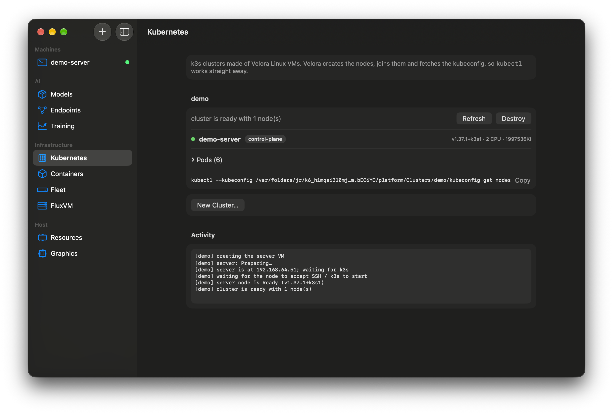

# 4. A Kubernetes cluster in one click



## Before you start
16 GB or more recommended, a few GB of free memory (the server VM uses 2 GiB), `kubectl` on your PATH (`brew install kubectl`). Clusters use **Ubuntu 26.04** guests.

## Steps
1. Open **Infrastructure → Kubernetes** and press **New Cluster…**. Name it, choose how many workers (0 gives a single-node cluster), press **Create**.
2. Velora creates the server VM, waits for its address, installs k3s with cloud-init, fetches the kubeconfig and waits for the node to be **Ready** (about a minute on an M4).
3. The screen lists nodes and pods. Press **Logs** on a pod to read its logs.
4. Use your own `kubectl` with the kubeconfig Velora wrote under `~/Library/Application Support/Velora/Platform/Clusters/<name>/kubeconfig`:
   ```bash
   export KUBECONFIG="$HOME/Library/Application Support/Velora/Platform/Clusters/demo/kubeconfig"
   kubectl get nodes
   kubectl create deployment web --image=nginx:alpine --replicas=2
   ```
5. **Destroy** stops and deletes the cluster's VMs.

## What you should see
`kubectl get nodes` shows one Ready node and the `web` pods Running.

## Troubleshooting
- *The VM hangs or CPU is pegged:* the Mac is swapping. Quit other VMs and apps and try again.
- *Do not use Debian here:* its 6.12.111 guest kernel oopses in `autofs4` under k3s.

**Verified:** a single-node cluster (node Ready in 39 s, nginx pods serving HTTP) on an Apple M4, macOS 27.2. **Multi-node join is not verified.**
