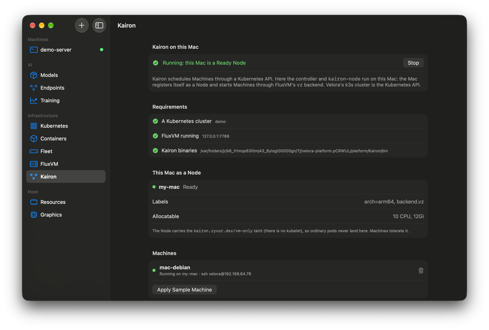

# 5. FluxVM and Kairon on a Mac



[FluxVM](https://github.com/zyvorai/zyvor-fluxvm) is a VM control plane; [Kairon](https://github.com/zyvorai/zyvor-kairon) schedules `Machine` resources onto nodes through the Kubernetes API. Both now run natively on a Mac: FluxVM with a `vz` backend on Virtualization.framework, and Kairon registering the Mac as a Node. Velora connects them: it can supervise a FluxVM daemon, hosts the Kubernetes API (Tutorial 4), and counts FluxVM's VMs in its memory ledger.

## Before you start
Tutorial 4 (a cluster to talk to), Xcode command line tools, Rust and Go toolchains, `brew install hivex`, an ARM64 raw Debian image (Velora's cached Debian image works once extracted).

## Steps, from the app (recommended)
1. **Cluster:** **Kubernetes → New Cluster…** (Tutorial 4) and wait for Ready.
2. **FluxVM:** open **FluxVM** and press **Start** (it needs a built `fluxctl`; see [FluxVM](../fluxvm.md)).
3. **Kairon:** open **Kairon**. The *Requirements* list shows a cluster, FluxVM running and the Kairon binaries. If the binaries are not built, set `KAIRON_DIR` to a checkout of `zyvor-kairon` (or keep it at `~/tt/tt/kairon`), install Go, and press **Build**.
4. Press **Start**. Velora applies Kairon's CRDs and RBAC, mints ServiceAccount tokens and starts the controller and `kairon-node`. This Mac appears under **This Mac as a Node** as Ready (`arch=arm64, backend.vz`).
5. Press **Apply Sample Machine**. Debian 13 boots on this Mac through FluxVM; the Machine shows `Running` and `ssh velora@<address>`. The trash button deletes it and FluxVM removes the VM.

## Steps, by hand
1. **Build FluxVM** (`github.com/zyvorai/zyvor-fluxvm`, see its `docs/macos.md`): `cargo build -p fluxctl`.
2. **Build Kairon** (`github.com/zyvorai/zyvor-kairon`, see its `docs/macos.md`): `go build ./...`.
3. **Point Kairon at your cluster** and register the Mac: apply `deploy/crd.yaml`, `deploy/rbac.yaml` and `deploy/macos/rbac.yaml`, then run `kairon-controller` and `kairon-node` with `KAIRON_KUBE_URL`, `KAIRON_KUBE_TOKEN`, `KAIRON_KUBE_CA` and `NODE_NAME`.
   ```bash
   kubectl get nodes    # the Mac shows as a Node, taint kairon.zyvor.dev/vm-only
   ```
4. **Create a Machine** with `examples/macos-machine.yaml` (backend `vz`):
   ```bash
   kubectl apply -f examples/macos-machine.yaml
   kubectl get machine mac-debian -o jsonpath='{.status.guestIP}'
   ```
   Or run the whole check at once: `scripts/macos-e2e.sh /path/to/arm64-debian.raw`.

## What you should see
The Mac as a Ready Node, `mac-debian` Running with a `status.guestIP`, `ssh velora@<ip>` working, and the VM visible in Velora's FluxVM and Resources screens.

## Troubleshooting
- *Machine stays Pending:* it must tolerate the `vm-only` taint and select `backend.vz` (the example does).
- *Refused by Kairon:* the `vz` backend does not support tap networking, port forwards, NUMA, hugepages, hotplug, TPM, data disks or cdroms; the error names the field.
- *Only NAT networking:* the guest is reached at its address from the Mac; there are no port forwards.

**Verified** (Apple M4, macOS 27.2): Velora's `--selftest kairon`, FluxVM live test (create, SSH, pause, resume, stop, restart, delete), Velora's FluxVM self-test with ledger accounting, and Kairon's `scripts/macos-e2e.sh` against a Velora-hosted k3s cluster. **Not verified:** macOS guests, the vsock proxy, multi-Mac clusters.
