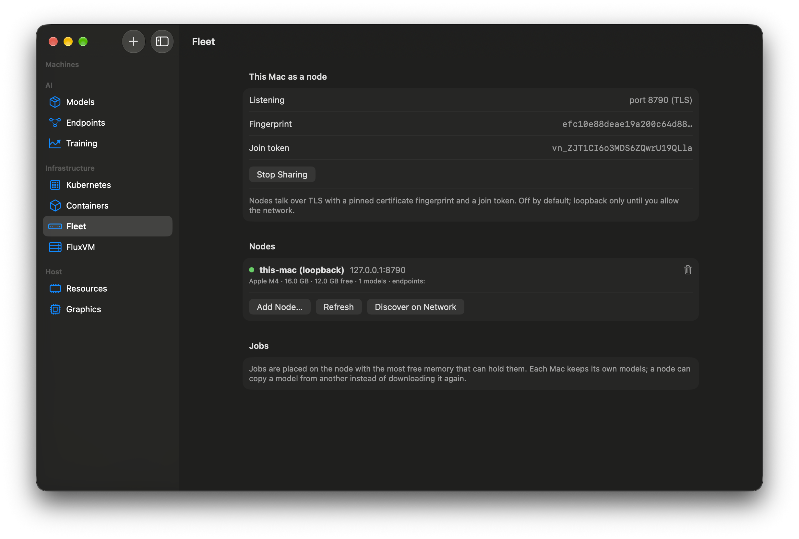

# 6. A fleet of Macs

## Before you start
Velora on each Mac. To try it with one Mac, the node agent can talk to itself on loopback.

## Steps
1. On the Mac that will **serve**: open **Infrastructure → Fleet**, press **Start Node Agent**. It listens over TLS with a self-signed certificate. Loopback only by default; allow the network only when you mean to. The screen shows the **port**, the certificate **fingerprint** and a **join token**.
2. On the Mac that will **manage**: press **Add Node…**, enter the host, port, token and fingerprint (or **Discover on Network** to find nodes on the LAN over Bonjour and fill them in). The fingerprint is pinned; a wrong one is refused.
3. The node's inventory appears: chip, memory, free memory, models, endpoints.
4. Submit a job (**Try**): Velora places it on the node with the most free memory that can hold it. A node can copy a model from another node (SHA-256 verified) instead of downloading it again.

## What you should see
Peers listed with their free memory, jobs completing on the chosen node, and a model that arrived without a second download.

## Troubleshooting
- *Refused:* wrong token or fingerprint (copy both from the serving Mac's Fleet screen).
- *Not discovered:* Bonjour discovery needs both Macs on the same network and the serving Mac to allow the LAN.

**Verified:** loopback fleet with separate agent processes (inventory, memory-aware placement, wrong token and wrong fingerprint refused, remote pull/deploy/inference, model copy with SHA-256, Bonjour discovery) on one Apple M4. **A second physical Mac is not tested.**
